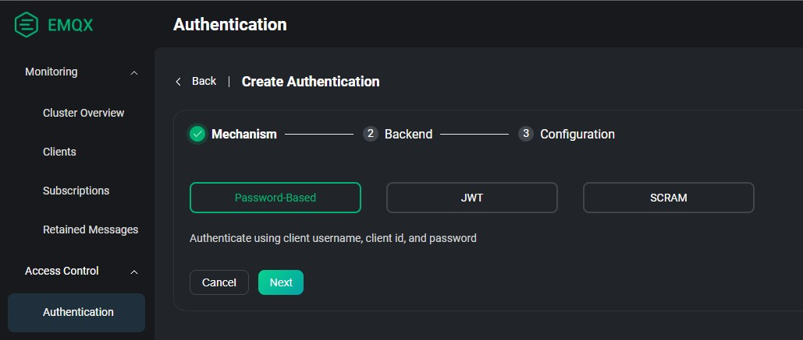
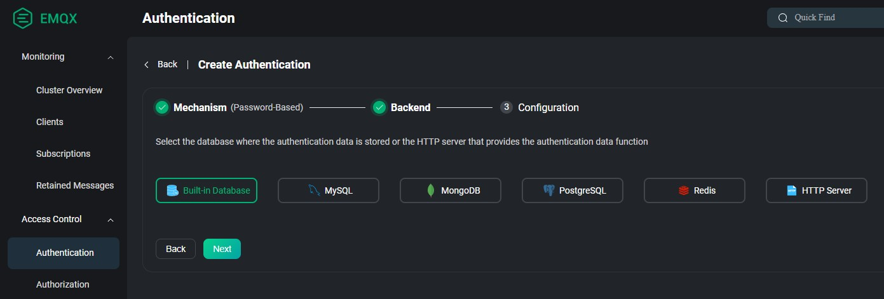
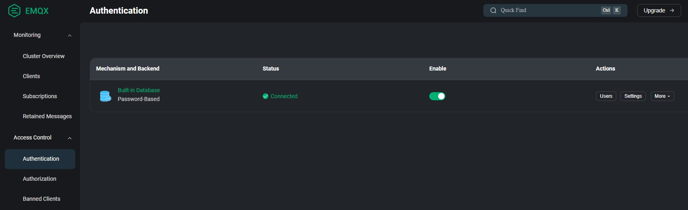

# Autonomous Vehicle Backend System

This document provides instructions for setting up and running the autonomous vehicle backend system. This system manages communication with autonomous vehicles via MQTT, handles vehicle registration, ingests telemetry data, assigns missions, and tracks mission statuses.

## Prerequisites

Before you begin, ensure you have Docker installed on your system. You can download and install Docker from [Docker's official website](https://www.docker.com/get-started).

## Setup Instructions

### 1. Clone the Repository

Clone the repository containing the project files to your local machine.

### 2. Configure Environment Variables

The project uses a `.env` file to manage environment-specific configurations.

* Navigate to the root directory of the project.
* You will find a file named `.env.example`. Create a copy of this file and name it `.env`.
  ```bash
  cp .env.example .env
  ```
* Open the `.env` file and update the variables as needed for your environment. The file comes with default values to help you get started, including sample data for a vehicle and a mission:
  ```env
  # Application Settings
  PORT=3000
  NODE_ENV=development
  ENVIRONMENT=development

  # MONGODB
  MONGO_HOST=localhost
  MONGO_PORT=27017
  MONGO_DATABASE=autonomous
  MONGO_APP_AUTH_SOURCE=admin
  MONGO_USERNAME=root
  MONGO_PASSWORD=secret
  MONGO_APP_USERNAME=autonomous
  MONGO_APP_PASSWORD=autonomous

  # SEED DATA
  VEHICLE_ID=ae8bf801-8886-4bb1-9c6b-5acabc16a8db
  VEHICLE_NAME="Drone V1"
  MISSION_ID=7abc702b-3145-425b-bc1e-d902d9ac014d
  MISSION_NAME="Perform aerial survey"

  # MQTT Configuration
  MQTT_PROTOCOL=mqtt
  MQTT_HOST=localhost
  MQTT_PORT=1883
  MQTT_USERNAME=autonomous
  MQTT_PASSWORD=autonomous

  # APP SECRET
  APP_JWT_SECRET=9c34cbbf-4ed0-4f7e-9dae-4fa8eb799c4e
  ```
  **Note**: The `docker-compose.yml` file is configured to use some of these variables (e.g., for MongoDB and MQTT credentials when running within Docker). Specifically, `MONGO_HOST` should be `mongodb` and `MQTT_HOST` should be `emqx` for the `autonomous_api` service when running via Docker Compose, as these are the service names within the Docker network. The `.env` file provided already has these values set for a local development environment outside of Docker. Ensure the `.env` file used by the `autonomous_api` container reflects the Docker service names if you are not relying on the Docker Compose environment variable injection for these specific settings.

### 3. Set Up EMQX MQTT Broker

The system uses EMQX as its MQTT broker. The Docker Compose setup will start an EMQX container.

* **Access EMQX Dashboard**: Once Docker Compose is running (see next step), you can access the EMQX dashboard.
    * **URL**: `http://localhost:18083`
    * **Login**: `admin`
    * **Password**: `public`
* **Note**: As per the requirements, you can skip changing the default password. The `autonomous_api` service in `docker-compose.yml` is configured to use `admin` and `public` as default MQTT credentials if `MQTT_USERNAME` and `MQTT_PASSWORD` are not set in the environment.

### 4. Run the Application with Docker Compose

Ensure Docker is running on your machine.

* Open your terminal, navigate to the root directory of the project (where the `docker-compose.yml` file is located).
* Run the following command to build and start all the services in detached mode:
  ```bash
  docker compose up -d
  ```
  This command will start the following services:
    * `emqx`: The MQTT broker.
    * `mongodb`: The MongoDB database instance.
    * `telemetry_sender`: A Python script to simulate sending telemetry data.
    * `autonomous_api`: The main backend application.

### 5. Import Postman Collection

A Postman collection may be provided to interact with the API endpoints.

* Open Postman.
* Click on "Import".
* You can either upload the Postman collection file (e.g., `collection.json`) or import it from a link if provided.
* Once imported, you can use the collection to send requests to the API.

### 6. Access API Documentation (Swagger)

The API documentation is generated using Swagger and can be accessed once the application is running.

* **URL**: `http://localhost:3000/api`
  This will display the Swagger UI, where you can view all available API endpoints and their request/response schemas.

## System Overview and Backend Assignment Points

This backend system is designed to fulfill the requirements outlined in the "Backend Developer Assignment".

### 1. MQTT Broker Integration

* An EMQX MQTT broker is set up via Docker Compose.
* Authentication for the broker is enabled (default: admin/public).
* The backend application (`autonomous_api`) connects to this broker to send and receive messages from vehicles.
* Vehicle registration and authentication via MQTT would be handled by the application logic, ensuring that only registered vehicles can communicate.
* You must add a user in emqx before starting telemetry.

* **Login to EMQX Dashboard**: 
  * URL: `http://localhost:18083`
  * Username: `admin`
  * Password: `public`


* **Skip Password**: 
  * Skip the password change screen


* **Add User**: 
  * Go to "Authentication" > Create 


* **Select Authentication Method**
  * Select Password-Based (default) then click **Next** 



* **Choose Authentication Backend**
  * Select **Build-in Database** then click **Next**



* **Authentication Method Created**
    * You will now have an authentication method



* **Creating A User**
    * Click on the **Built-in Database**
    * Then navigate to **User Management** in the Tab which is next to **Overview** and **Settings**


* **Create User**
    * In **User Management** click on **Add**
    * Type in the application credentials
    * Username - autonomous
    * Password - autonomous
    * Click **Save**
    * Now the api and the python script will be able to communicate with the broker.    


### 2. Database Integration

* MongoDB is used as the database, started via Docker Compose.
* The backend application uses TypeORM to interact with MongoDB for storing:
    * Vehicle telemetry data (`TelemetryEntity`)
    * Vehicle information (`VehicleEntity`)
    * Mission details (`MissionEntity`)
    * Vehicle-mission assignments (`VehicleMissionEntity`)
    * Mission status updates (`VehicleMissionStatusEntity`)
* Schemas are defined using TypeORM entities, and entries are timestamped (`createdAt`, `updatedAt`, `timestamp` fields in various entities).

### 3. Vehicle Handling

* **Registration**: EMQX supports registration however vehicle registration via MQTT was not completed. While the provided code doesn't explicitly detail an MQTT-based registration flow, the infrastructure supports it. A dedicated MQTT topic could be used for vehicle registration requests. The backend would then create a `VehicleEntity`.
* **Authentication**: Incoming MQTT messages require validation in some topic scenarios, room for improvement there. The current `JwtGuard` is for HTTP API authentication. MQTT authentication is handled at the broker level and potentially within message handlers.

### 4. Telemetry and Status

* The `MqttController` listens for telemetry data on topics like `vehicle/+/telemetry`.
* The `TelemetryService` processes this data, validating the vehicle and storing the telemetry information (`VehicleTelemetry`) in the `telemetry` collection.
* Vehicle status is part of the telemetry payload.

### 5. Mission Handling

* **REST API for Mission Creation**:
    * `POST /mission`: Creates a new mission (`MissionController`, `CreateMissionDto`).
    * `POST /vehicle-mission`: Assigns a vehicle to a mission (`VehicleMissionController`, `CreateVehicleMissionDto`).
* **Sending Missions via MQTT**:
    * Upon creating a vehicle-mission assignment, the `CreateVehicleMissionListener` is triggered.
    * It updates the mission status to `QUEUED` and publishes the mission details to a vehicle-specific MQTT topic (e.g., `vehicle/{vehicleId}/mission`) using `MqttPublisherService`.
* **Receiving Mission Responses/Status via MQTT**:
    * The `MqttController` listens on topics like `vehicle/+/mission/status` for mission updates from vehicles.
    * The `VehicleMissionStatusListener` processes these updates, persisting the new status (e.g., `IN_PROGRESS`, `COMPLETED`, `FAILED`) and timestamp to the database via `VehicleMissionStatusService`.

### 6. MQTT Controllers

The `MqttController` handles messages from different topics:

* `vehicle/+/telemetry`: For vehicle telemetry data.
* `vehicle/+/mission`: For vehicle mission data/simulation responses (though typically the backend sends *to* this, and listens for status *from* another).
* `vehicle/+/mission/status`: For vehicles to report their mission status back to the backend.

### 7. Reporting

* A REST API endpoint `GET /report/missions` is available to generate a JSON report.
* The `ReportsService` compiles this report, including missions and their assigned vehicles along with their statuses.

### Topic and Message Structure

* **Topics**:
    * Telemetry: `vehicle/{vehicleId}/telemetry` (e.g., `vehicle/ae8bf801-8886-4bb1-9c6b-5acabc16a8db/telemetry`)
    * Mission Instructions (Backend to Vehicle): `vehicle/{vehicleId}/mission` (e.g., `vehicle/drone-001/mission`)
    * Mission Status (Vehicle to Backend): `vehicle/{vehicleId}/mission/status` (e.g., `vehicle/drone-001/mission/status`)
    * The use of `{vehicleId}` in the topic structure allows for targeted communication and easy identification of the message source/destination.
* **Message Format**:
    * JSON is used for message payloads. This is a widely supported, human-readable, and easy-to-parse format.
    * **Telemetry Payload** (`VehicleTelemetry`):
      ```json
      {
        "vehicleId": "string",
        "timestamp": "Date",
        "location": { "type": "Point", "coordinates": [number, number] },
        "status": "string" // e.g., "active", "idle", "error"
      }
      ```
    * **Mission Instruction Payload** (Backend to Vehicle - `VehicleMissionStatusResponse`):
      ```json
      {
        "vehicleMissionId": "string",
        "vehicleId": "string",
        "missionId": "string",
        "createdAt": "Date",
        "updatedAt": "Date",
        "status": "PENDING", // Initial status
        "timestamp": "Date" // UTC Timestamp of this status update
      }
      ```
    * **Mission Status Payload** (Vehicle to Backend - `VehicleMissionResponse`):
      ```json
      {
        "vehicleMissionId": "string",
        "vehicleId": "string",
        "status": "PENDING" | "QUEUED" | "IN_PROGRESS"  | "COMPLETED" | "FAILED",
        "timestamp": "Date"
      }
      ```
    * **Why this format?**
        * **JSON**: Lightweight, widely adopted, and easy for both NestJS backend and potentially diverse vehicle systems (e.g., Python scripts) to handle.
        * **Clear Identifiers**: `vehicleId`, `missionId`, `vehicleMissionId` allow for precise tracking and correlation of data.
        * **Timestamps**: Essential for logging, debugging, and understanding the sequence of events.
        * **Structured Payloads**: Defined types (using TypeScript in NestJS) ensure data consistency and help prevent errors during serialization/deserialization.

## Testing

The general flow involves:

1.  **Vehicle Telemetry Data Flow via MQTT**:
    * The `docker-compose.yml` sets up a `telemetry_sender` service. This service uses a Python script (`send_telemetry.py`) located in the `integrations/send_telemetry` directory, which is built using `integrations/send_telemetry/Dockerfile`.
    * This script simulates sending vehicle telemetry data over MQTT to `vehicle/{VEHICLE_ID}/telemetry` (where `VEHICLE_ID` is taken from the `.env` file).
    * To use it:
        * Ensure the `telemetry_sender` service is running (started by `docker compose up -d`).
        * You will have to initiate the script in the docker terminal with `python send_telemetry.py` You can view its logs using `docker logs telemetry_sender`.
        * You must provide a `--topic` and a `--vehicle` in the arguments.
        * e.g `python send_telemetry.py --broker emqx --status idle --vehicle ae8bf801-8886-4bb1-9c6b-5acabc16a8db --topic vehicle/ae8bf801-8886-4bb1-9c6b-5acabc16a8db/telemetry`
        * You will see the following output:
      ```log
        Using client ID: client_ae8bf801-8886-4bb1-9c6b-5acabc16a8db with username: autonomous
        Warning: Client does not appear to be connected after initial connection attempt
        Sending telemetry data to vehicle/ae8bf801-8886-4bb1-9c6b-5acabc16a8db/telemetry...
        Data: {"vehicleId": "ae8bf801-8886-4bb1-9c6b-5acabc16a8db", "timestamp": "2025-05-18T18:42:46.693553+00:00", "location": {"type": "Point", "coordinates": [-122.4208691365827, 37.774680559076906]}, "status": "idle"}
        Connected to MQTT Broker!
        Message ID: 1 published
        Telemetry data sent successfully!
        Disconnected from MQTT broker
      ```
      * You can use the `telemetry/vehicle/:id` endpoint in postman to retrieve the telemetry of the vehicle
      ```json
      [
          {
            "telemetryId": "7c3fc565-4cbc-4a89-abd2-200ea86d50c2",
            "vehicleId": "ae8bf801-8886-4bb1-9c6b-5acabc16a8db",
            "timestamp": "2025-05-18T18:42:46.693553+00:00",
            "location": {
            "type": "Point",
              "coordinates": [-122.4208691365827, 37.774680559076906]
            },
            "status": "idle"
          }
      ]
      ```
    * The python script authenticates against the MQTT broker however it uses credentials created manually in EMQX. There are options for api keys, permissions etc but this is not implemented in the current code.
    * Verify that telemetry data appears in the database.
2.  **Mission Request via Postman**:
    * Use Postman to send a `POST` request to `/vehicle-mission` to assign a mission.
    * Verify the mission is logged and an MQTT message is sent to `vehicle/{vehicleId}/mission`.
3.  **Mission Response Handling**:
    * The `VehicleMissionListener` in the backend includes logic to simulate a vehicle picking up a mission and sending status updates (`PENDING`, `QUEUED`, `IN_PROGRESS`, then `COMPLETED` or `FAILED`) back to the MQTT topic `vehicle/{vehicleId}/mission/status`.
    * This simulation helps test the backend's ability to process these status updates.    
4.  **Mission Status Update (Further Updates)**:
    * As described above, the simulation within `VehicleMissionListener` covers different statuses.
    * Verify the database accurately reflects the final mission status.
5.  **Reporting**:
    * Use Postman to send a `GET` request to `/report/missions`.
    * Verify the JSON report contains the correct mission assignments and statuses.
